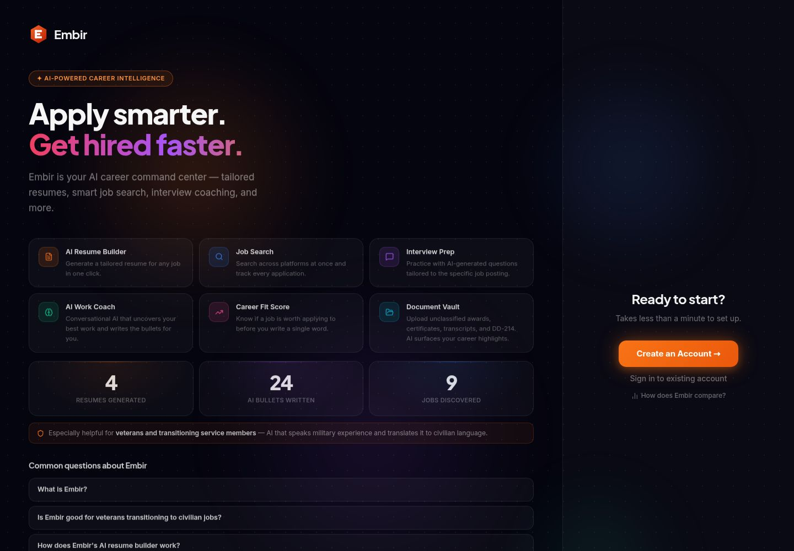

# Embir — Job Search & Career Assistant

**A product-development case study covering career workflows, AI-assisted implementation, and practical software quality decisions.**

[Explore the live application](https://embir.app)

*Development preview of the public landing page.*

## Overview

Embir brings job discovery, career records, tailored resumes, company research, and interview preparation into one web application. It helps users connect their actual experience to the requirements of a specific opportunity rather than repeatedly rebuilding their application materials.

This repository is a **project showcase**, not the application's complete source-code repository. It contains no user records, credentials, or private application configuration. Most application workflows require a user account.

## The problem addressed

A job search often involves disconnected tools: saved listings, work-history notes, resume documents, company research, and interview preparation. Tailoring a resume adds another challenge: using the employer's language while accurately representing the candidate's experience.

Embir organizes these activities into a connected workflow:

1. Build a reusable record of experience, education, certifications, and skills.
2. Discover or save an opportunity and its job description.
3. Generate and edit a resume tailored to that opportunity.
4. Review keyword coverage and export application materials.
5. Prepare for the company and interview.

## My contribution

I directed AI-assisted development in Replit by defining desired behaviors, reviewing the application's outputs, identifying gaps, and guiding iterative improvements.

Examples of work I drove include:

- Refining professional summaries to connect supported experience with the listing's responsibilities and qualifications.
- Improving the way resume content is selected for a readable two-page document.
- Making resume layout controls more flexible.
- Investigating job-listing capture and browser-extension connection issues.
- Distinguishing confirmed experience from knowledge suggested by education or certifications.

Development used AI assistance for implementation. This showcase describes my product direction and involvement in the development process; it does not imply that every line of application code was written manually by me.

## Selected capabilities

| Capability | User value |
|---|---|
| Career profile and work history | Reuse career evidence instead of starting from a blank document for every application. |
| Job search and saved listings | Keep opportunities and their descriptions connected to application preparation. |
| Tailored resume generation and editing | Adapt summaries, competencies, and experience to a particular opportunity. |
| Keyword coverage review | Identify which important listing terms appear in the resume and which may need attention. |
| Resume layouts and PDF/Word exports | Prepare application materials in an editable workflow. |
| Company research and interview preparation | Connect application materials with preparation for the employer and role. |
| Safari job-saving extension | Capture opportunities while browsing external job sites. |

Keyword coverage is a review aid, **not a prediction of an employer's ATS score or a guarantee of hiring outcomes**. Generated material still requires the user's review.

## Product and technical decisions

### Preserve career evidence

Tailoring an individual resume should not silently rewrite the user's source work history. Reusable career records and application-specific documents serve different purposes.

### Keep claims grounded

Job-description language should be used when the user's background supports it. Completing a certification can support formal knowledge, but does not automatically demonstrate hands-on experience with every related tool.

### Separate generation from measurement

AI assists with extracting requirements and generating text. Keyword presence is checked with deterministic matching logic rather than relying on a model to decide whether an exact term appears.

### Select content rather than shrink the font

A two-page target should encourage prioritization, not filling every role with the maximum number of bullets. Bullet selection considers relevance and content length while leaving room for other sections. Physical pagination still needs checking against the rendered document.

## Technical overview

| Area | Technologies or approach |
|---|---|
| Frontend | React, TypeScript, Vite, Tailwind CSS, and reusable UI components |
| Backend | Node.js and Express |
| Data | PostgreSQL with Drizzle ORM |
| API integration | OpenAPI-based contracts and a generated React API client |
| AI features | OpenAI integration for supported generation and analysis workflows |
| Document generation | Server-side Chromium PDF rendering and Word document generation |
| Development environment | Replit |

At a high level, the React application communicates with the Express API. The backend manages stored career and application data, coordinates AI requests, applies deterministic processing, and generates exported documents.

## Quality practices demonstrated

- Automated tests for keyword matching and resume-selection rules.
- Deterministic limits and validation alongside AI-generated output.
- PDF rendering checks to evaluate pagination at readable font sizes.
- Iteration based on observed behavior, including job capture, connection state, layout, and generated content.

These are examples of checks used during development, not a claim of comprehensive test coverage or a security certification.

## What this project demonstrates

- **Program and project management:** translating needs into requirements, prioritizing improvements, coordinating dependencies, and following issues through verification.
- **Product and operations:** designing connected workflows, reducing repetitive work, and balancing convenience with accuracy and user control.
- **Technical collaboration:** working with a full-stack application, integrating AI with deterministic logic, and reasoning about data integrity, document rendering, and external services.

## Scope of this repository

This is a private-source product showcase. No open-source license for the application is granted by this repository. Public code examples, if added later, should identify their own scope and license.
